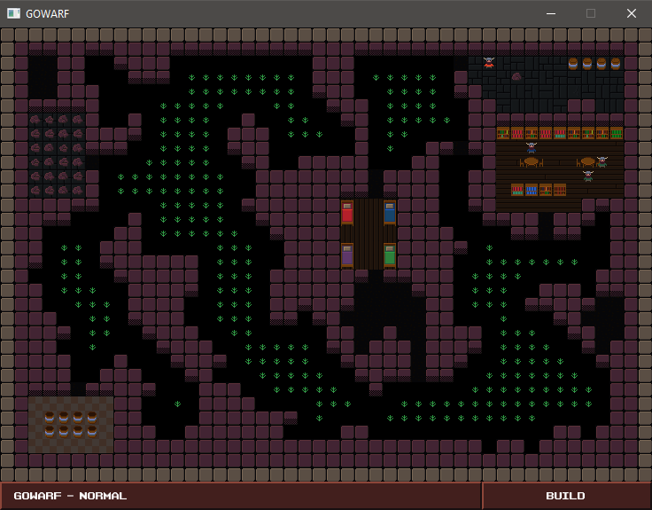

# WARF (WIP)

A base building game, inspired by Roguelikes and the original Dungeon Keeper series.

Built with [Golang](https://golang.org/) and the [Ebiten](https://ebiten.org/) framework.



## What's with all the comments?

The linter I used when first writing this was _very adament_ in enforcing a specific style
of commenting public functions, leading to great declarative comments like:
```
// Returns10 returns 10.
func Returns10() int { return 10 }
```

I have since switched to another linter ([golangci-lint](https://golangci-lint.run/)) just to avoid this.

## Implemented

✅ Basic world graphics

✅ Basic dwarf graphics

✅ Cellular automata

✅ Flood filling

✅ Mouse and keyboard input

✅ Collision detection

✅ Random walker

✅ A* pathfinding

✅ Wall select and deselect

✅ Job System

✅ Job: Digging walls

✅ Items

✅ Saving/loading
